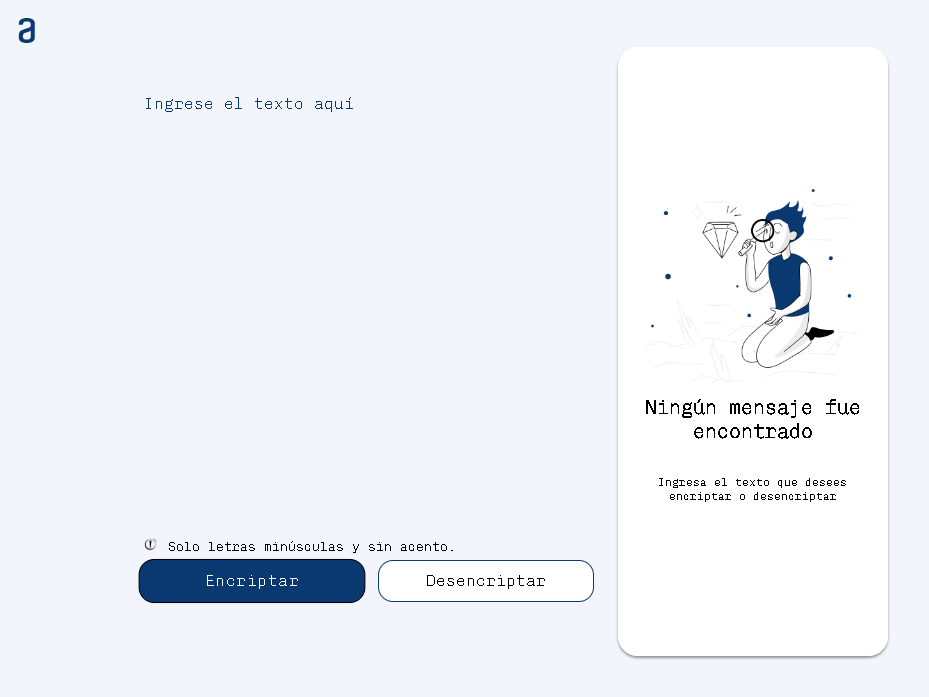
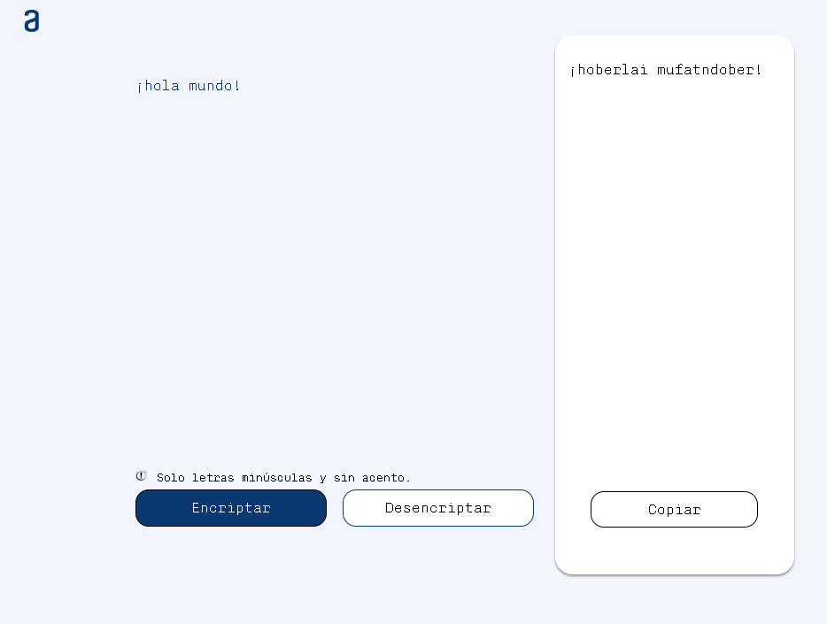

# Encriptador de texto
Challenge propuesto por Alura - ONE el cual permite encriptar/desencriptar texto.

Puedes acceder al sitio web en vivo del proyecto en [GitHub Pages](https://jsalbornozn.github.io/encriptador-de-texto/).

 
## Tecnologías utilizadas
- <i class="fab fa-html5"></i> HTML
- <i class="fab fa-css3-alt"></i> CSS
- <i class="fab fa-js"></i> JavaScript

